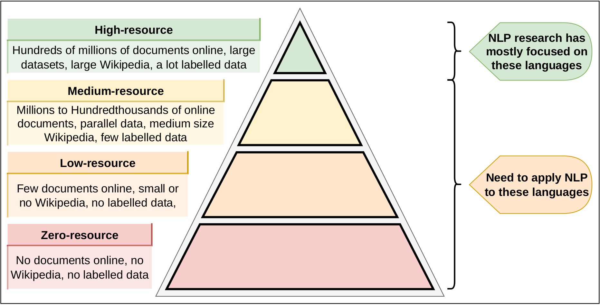

<!-- PROJECT LOGO -->
 

  

  <h3 align="center">Master's Thesis Presentation by Christian Schuler</h3>

  

    Thesis Title: Neural Machine Translation for Dialects of Low-Resource Languages by Incorporating Linguistic Information to Create Synthetic Data

# Introduction
Navigate directly to the [Slides](https://christianschuler8989.github.io/MA-Thesis-Slides). 

These slides are built upon [**AwesomeAnranAnimotion**](https://github.com/AnranW/AwesomeAnranAnimotion), which uses [Animotion](https://animotion.pages.dev). 

# Navigation
Here you (will) find the code that is part of this thesis: [Thesis-Code-Repository](https://github.com/christianschuler8989/MA-Thesis)

<!-- CONTACT -->
## Contact

Christian Schuler - [GitHub Page](https://christianschuler8989.github.io/)

(<a href="#readme-top">back to top</a>)

<!-- ACKNOWLEDGMENTS -->
## Acknowledgments

A list of helpful resources and people I would like to give credit and/or express my gratidude to:

* [My supervisor Dr. Sina Ahmadi who always made sure to bring me back on track when I got too interested in side projects and literature](https://sinaahmadi.github.io/)
* [My supervisor Dr. Seid Muhie Yimam who always kept a positive spirit and turned into an accomplice for some of the interesting side projects](https://seyyaw.github.io/)
* [Best-README-Template](https://github.com/othneildrew/Best-README-Template) 
<!-- * [The R Project for Statistical Computing](https://www.r-project.org/) -->

(<a href="#readme-top">back to top</a>)

<!-- MARKDOWN LINKS & IMAGES -->
<!-- https://www.markdownguide.org/basic-syntax/#reference-style-links -->
[contributors-shield]: https://img.shields.io/github/contributors/christianschuler8989/MA-Thesis-Slides.svg?style=for-the-badge
[contributors-url]: https://github.com/christianschuler8989/MA-Thesis-Slides/graphs/contributors
[forks-shield]: https://img.shields.io/github/forks/christianschuler8989/MA-Thesis-Slides.svg?style=for-the-badge
[forks-url]: https://github.com/christianschuler8989/MA-Thesis-Slides/network/members
[stars-shield]: https://img.shields.io/github/stars/christianschuler8989/MA-Thesis-Slides.svg?style=for-the-badge
[stars-url]: https://github.com/christianschuler8989/MA-Thesis-Slides/stargazers
[issues-shield]: https://img.shields.io/github/issues/christianschuler8989/MA-Thesis-Slides.svg?style=for-the-badge
[issues-url]: https://github.com/christianschuler8989/MA-Thesis-Slides/issues
[license-shield]: https://img.shields.io/github/license/christianschuler8989/MA-Thesis-Slides.svg?style=for-the-badge
[license-url]: https://github.com/christianschuler8989/MA-Thesis-Slides/blob/main/LICENSE
[linkedin-shield]: https://img.shields.io/badge/-LinkedIn-black.svg?style=for-the-badge&logo=linkedin&colorB=555
[linkedin-url]: https://www.linkedin.com/in/christian-schuler-59090a177/
[screenshot-datastructure]: public/construction-itsupport.png